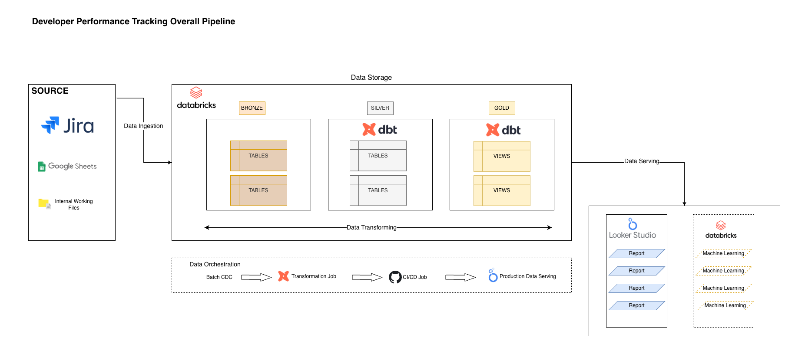
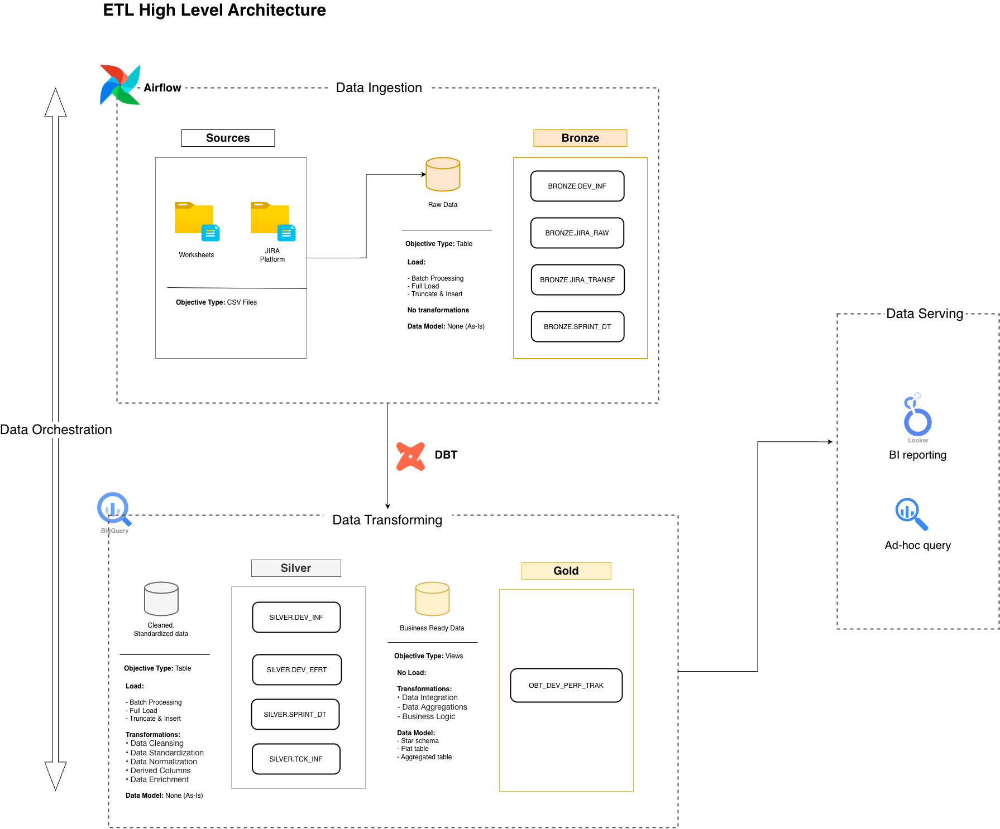

# Analytics Engineer Project
This is an Analytics Engineer project that focuses not only on the analytics aspect but also on the engineering side. In this project, I will build an end-to-end BI solution, from gathering requirements and brainstorming the data model to creating the database and designing a meaningful dashboard.

The tools: DBT, GCP (BigQuery), Airflow 



## Data Generation
The data generated from Jira and multiple worksheets in my development team contains developer information, sprint period dates, and development tickets spanning from the project's inception to the current development phase.

1. Ticket Data from Jira Platform
2. Working G-sheets in Internal Team (over 5 worksheets)

## Data Storage
In this project, I utilize BigQuery to store data for ingestion, transformation, and serving. 

The action we need to take in this section:
- ✅ Data Architecture: Medallion Architecture.
- ✅ Data Modeling: Dimensional Modeling (Star Schema).
- ❗️ Clustering and Partitioning:  Not applicable in this project due to the data scale being small. In the future, if the data increases dramatically and contains multiple projects instead of only the DDE project. I will apply later on.

**The Output in this section:**
- Star Schema Diagram


- ETL Architecture Diagram


### Data Architecture Approach
I would use Medallion Architecture (Multip-Hop), which contains Bronze, Silver, and Gold layers. Each layer has a different purpose in processing data

- BRONZE: Store a raw or renamed table from Jira Platform or G-sheets
- SILVER: Define the logic and metric, and create Fact or Dimension tables
- GOLD: Presentation layer with provide a final view connect to Looker Studio (BI tool) for analytics

### Data Modeling Workflow
**Requirements**
**Requirement 1:** Monitor the performance and effort of each developer throughout each Program Increment (PI) and iteration.  
**Requirement 2:** Monitor the development status of the product in the DDE project 
#### Conceptual Modeling
##### Select Business Process
**Business Process 1:** Tracking the development status of each Jira ticket within every iteration.  
**Business Process 2**: Tracking the logging product status, as reported by the Scrum Master, every week. 

=> **Purpose**: It generates or captures performance measurements (metrics) that translate into facts in the dimensional model.
##### Declare a grain
1. Every action that modifies a Jira development ticket.  
2. Every status update in the product.  

=> **Purpose**: It answers the question, "How do you describe a single row in the fact table?"

#### Logical Modeling
##### Identify Dimensions
- Developer Info dimension: developer id, Vietnamese name, English name, Spoke Team, Project start date, Project end date, Current flag
- Sprint date dimension: Sprint name, PI name, Start date, End date, Active flag
- Ticket Dimension: Ticket ID, Ticket Name, Parent ID, Ticket Status, Start Date, Update Date, Description
- Product dimension: Product name, Spoke, Product type
- Capacity dimension: Developer name, working date, on leave flag
##### Identify Facts
**Developer Effort - Period Snapshot Fact Table Approach**
- Grain: one row per development ticket in a specific period
- Measurements: Story point

| Developer ID | Ticket ID | Status      | Sprint           | Update Date | Completed Date | Story Point |
| ------------ | --------- | ----------- | ---------------- | ----------- | -------------- | ----------- |
| 1ABDC2       | 123       | In Progress | PI18 Iteration 4 | 2025-12-05  |                | 3           |
| 1ABDC2       | 123       | Done        | PI18 Iteration 5 | 2025-12-15  | 2025-12-15     | 3           |
| 1XYZF2       | 456       | Done        | PI18 Iteration 5 | 2025-12-16  | 2025-12-16     | 1           |
| 2CDEF3       | 789       | Done        | PI18 Iteration 5 | 2025-12-14  | 2025-12-14     | 5           |
| 3GHJK4       | 901       | Done        | PI18 Iteration 5 | 2025-12-17  | 2025-12-17     | 8           |
| 1ABDC2       | 456       | Done        | PI18 Iteration 5 | 2025-12-18  | 2025-12-18     | 2           |
| 2CDEF3       | 123       | Done        | PI18 Iteration 5 | 2025-12-16  | 2025-12-16     | 4           |
| 3GHJK4       | 789       | In Progress | PI18 Iteration 5 | 2025-12-16  |                | 6           |
| 1XYZF2       | 901       | To Do       | PI18 Iteration 5 | 2025-12-16  |                | 7           |

#### Physical Modeling
In this section will define data types and constraints for the Fact and dimensions tables
##### Fact Tables

**Developer Effort** 

| Column Name | Data Type | Constraint |
| ----------- | --------- | ---------- |
| DEV_ID      | STRING    | NOT NULL   |
| TCK_ID      | STRING    | NOT NULL   |
| TCK_STS     | STRING    |            |
| PI_ID       | STRING    | NOT NULL   |
| UPD_DT      | TIMESTAMP |            |
| CMP_DT      | TIMESTAMP |            |
| STR_PNT     | FLOAT64   |            |


```sql
CREATE OR REPLACE TABLE SILVER.FCT_DEV_EFRT (
  DEV_ID STRING NOT NULL,
  TCK_ID STRING NOT NULL,
  TCK_STS STRING,
  PI_ID STRING NOT NULL,
  UPD_DT TIMESTAMP,
  CMP_DT TIMESTAMP,
  STR_PNT FLOAT64
)
```

##### Dimension Tables

**Developer Info Dimension**

| Column name | Data Type |          |
| ----------- | --------- | -------- |
| DEV_ID      | STRING    | NOT NULL |
| ENG_NM      | STRING    |          |
| VIE_NM      | STRING    |          |
| SPK_NM      | STRING    |          |
| PJC_SRT_DT  | DATE      |          |
| PJC_END_DT  | DATE      |          |
| CUR_FLG     | BOOL      |          |

```sql
CREATE OR REPLACE TABLE `SILVER.DIM_DEV_INF` (
  DEV_ID STRING NOT NULL,
  ENG_NM STRING,
  VIE_NM STRING,
  SPK_NM STRING,
  PJC_SRT_DT DATE,
  PJC_END_DT DATE,
  CUR_FLG BOOL
);
```

 **Sprint Date Dimension**

| Column name | Data Type |          |
| ----------- | --------- | -------- |
| PI_ID       | STRING    | NOT NULL |
| PI_NUM      | STRING    |          |
| ITR_ID      | STRING    |          |
| STR_DT      | DATE      |          |
| END_DT      | DATE      |          |
| CAL_DT      | DATE      |          |
| ACT_FLG     | BOOL      |          |
|             |           |          |

```sql
CREATE OR REPLACE TABLE `SILVER.DIM_SPRINT_DATE` (
  PI_ID STRING NOT NULL,
  PI_NUM STRING,
  ITR_ID STRING,
  STR_DT DATE,
  END_DT DATE,
  CAL_DT DATE,
  ACT_FLG BOOL
);
```

**Ticket Dimension**

| Column Name | Data Type | Constraint |
| ----------- | --------- | ---------- |
| TCK_ID      | STRING    | NOT NULL   |
| TCK_NM      | STRING    |            |
| PRN_ID      | STRING    |            |
| TCK_STS     | STRING    |            |
| STR_DT      | DATE      |            |
| UPD_DT      | DATE      |            |

```sql
CREATE OR REPLACE TABLE `SILVER.DIM_TICKET_INF` (
  TCK_ID STRING NOT NULL,
  TCK_NM STRING,
  PRN_ID STRING,
  TCK_STS STRING,
  STR_DT DATE,
  UPD_DT DATE
);
```


##  Data Serving
In this section, I focus on building a dashboard to track developer effort. The crucial questions we need to keep in mind are:

1. What insight do we want to convey?
2. How can we use charts and color to communicate that idea effectively?

In the Developer Performance Tracking Dashboard, I applied two simple approaches: the Z-layout and color.

- **Z-layout**: Presents information from overall to detailed.
- **Color psychology**: Uses color shades to indicate performance status or development state, such as green for completed, blue for in progress, and red for canceled tickets.

These approaches, along with other steps such as removing gridlines and axis labels (X and Y) from the charts, help reduce the mental load for users as they interact with the dashboard.

The main goal of the dashboard is to present insights efficiently while minimizing users’ cognitive effort and time.


