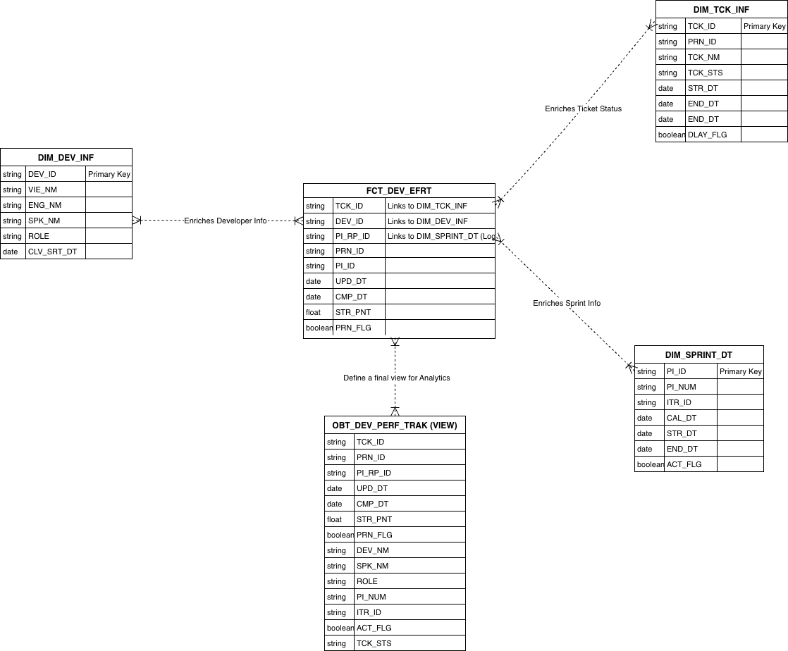
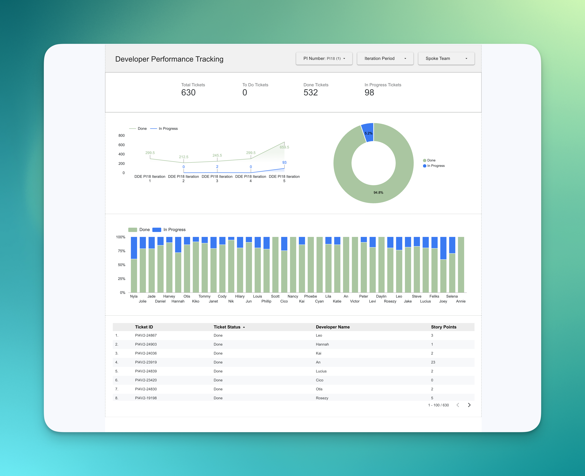
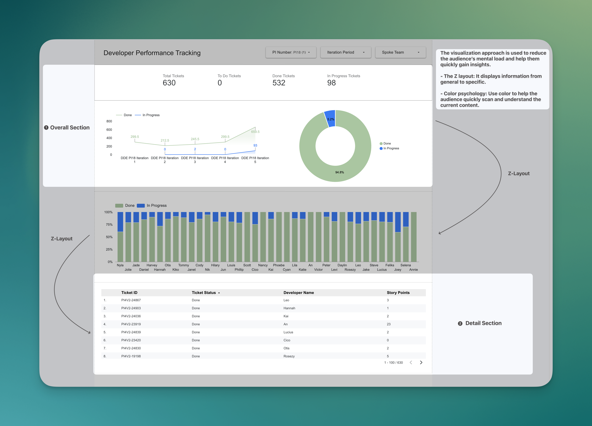

# Analytics Engineer Project
This is an Analytics Engineer project that focuses not only on the analytics aspect but also on the engineering side. In this project, I will build an end-to-end BI solution, from gathering requirements and brainstorming the data model to creating the database and designing a meaningful dashboard.

Data Stacks: #DBT, #databricks, #Medallion_Architecture, #dimensional_modeling

## Data Architecture

In this project, I decided to apply Medallion Architecture, which contains Bronze, Silver, and Gold Layers. Each layer has a different purpose in processing data.
- Bronze: Store a raw or renamed table from Jira Platform or Internal working files, ensuring data integrity and traceability
	-> Output: Tables without transformation
- Silver: Define the logics and metrics according to business requirements.
	-> Output: Structured tables with aggregated metrics, or transformed columns
- Gold: Presentation layer with providing a final view connect to BI tools (Looker Studio), ensuring clean and optimized data for reporting
	-> Output: Final Views with star schema### Data Modeling Workflow
	
=> **The reason**: Medallion Architecture is flexibility, audibility and Scalability currently in this BI solution only apply for one project in my team, however in the future if team leader or manager request to include multiple projects. It allows easy adaptation to changing their requirement later on. And It's also easier to track transformation and debug issues.

## Data Modeling
Star Schema Diagram


### 1. **Identify Business Requirements**
   - **Requirement 1**: Monitor developer performance and effort across Program Increments (PIs) and iterations.  
   - **Requirement 2**: Track product development status in the DDE project.  
### 2. **Conceptual Modeling**
   - **Business Processes**:  
     1. Tracking Jira ticket development status within iterations.  
     2. Tracking weekly product status updates.  
   - **Grain**: One row per development ticket in a specific period.  

### 3. **Logical Modeling**
   - **Dimensions**:  
     1. **Developer Info**: DEV_ID, ENG_NM, VIE_NM, SPK_NM, PJC_SRT_DT, PJC_END_DT, CUR_FLG.  
     2. **Sprint Date**: PI_ID, PI_NUM, ITR_ID, STR_DT, END_DT, CAL_DT, ACT_FLG.  
     3. **Ticket**: TCK_ID, TCK_NM, PRN_ID, TCK_STS, STR_DT, UPD_DT.  
     4. **Product**: PRD_NM, SPK, PRD_TYPE.  
     5. **Capacity**: DEV_NM, WORK_DT, ON_LEAVE_FLG.  
   - **Facts**:  
     **Developer Effort**: DEV_ID, TCK_ID, TCK_STS, PI_ID, UPD_DT, CMP_DT, STR_PNT.  
### 4. **Physical Modeling**
   - **Fact Table**:  
     ```sql
     CREATE OR REPLACE TABLE GOLD.FCT_DEV_EFFORT (
       DEV_ID STRING NOT NULL,
       TCK_ID STRING NOT NULL,
       TCK_STS STRING,
       PI_ID STRING NOT NULL,
       UPD_DT TIMESTAMP,
       CMP_DT TIMESTAMP,
       STR_PNT FLOAT64
     );
     ```
   - **Dimension Tables**:  
     ```sql
     -- Developer Info Dimension
     CREATE OR REPLACE TABLE GOLD.DIM_DEVELOPER (
       DEV_ID STRING NOT NULL,
       ENG_NM STRING,
       VIE_NM STRING,
       SPK_NM STRING,
       PJC_SRT_DT DATE,
       PJC_END_DT DATE,
       CUR_FLG BOOL
     );

     -- Sprint Date Dimension
     CREATE OR REPLACE TABLE GOLD.DIM_SPRINT_DATE (
       PI_ID STRING NOT NULL,
       PI_NUM STRING,
       ITR_ID STRING,
       STR_DT DATE,
       END_DT DATE,
       CAL_DT DATE,
       ACT_FLG BOOL
     );

     -- Ticket Dimension
     CREATE OR REPLACE TABLE GOLD.DIM_TICKET (
       TCK_ID STRING NOT NULL,
       TCK_NM STRING,
       PRN_ID STRING,
       TCK_STS STRING,
       STR_DT DATE,
       UPD_DT DATE
     );
     ```

### 5. **Integration with Medallion Architecture**
   - **Bronze Layer**: Store raw data from Jira and G-sheets.  
   - **Silver Layer**: Perform transformations and create structured tables.  
   - **Gold Layer**: Build the star schema with fact and dimension tables for BI tools (Looker Studio).  

**The reason:**
   - **Simplicity**: Star schema is easy to understand and query.  
   - **Performance**: Optimized for analytical queries.  

##  Data Serving
In this section, I focus on building a dashboard to track developer effort. The crucial questions we need to keep in mind are:

1. What insight do we want to convey?
2. How can we use charts and color to communicate that idea effectively?

In the Developer Performance Tracking Dashboard, I applied two simple approaches: the Z-layout and color.

- **Z-layout**: Presents information from overall to detailed.
- **Color psychology**: Uses color shades to indicate performance status or development state, such as green for completed, blue for in progress, and red for canceled tickets.

These approaches, along with other steps such as removing gridlines and axis labels (X and Y) from the charts, help reduce the mental load for users as they interact with the dashboard.

The main goal of the dashboard is to present insights efficiently while minimizing users’ cognitive effort and time.






